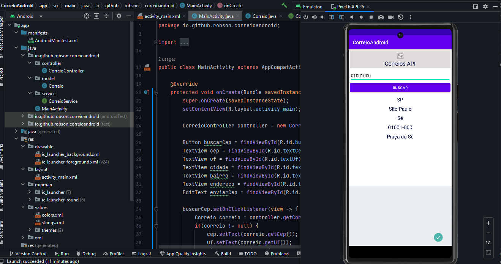

# correio-andorid-app
Sistema criado no Android para consumir API.

   *  Sistema criado para consumir Api dos correios pesquisando o CEP.
   * Link utilizado para teste : https://viacep.com.br
   * Utilizado a biblioteca retrofit2 no Android.

